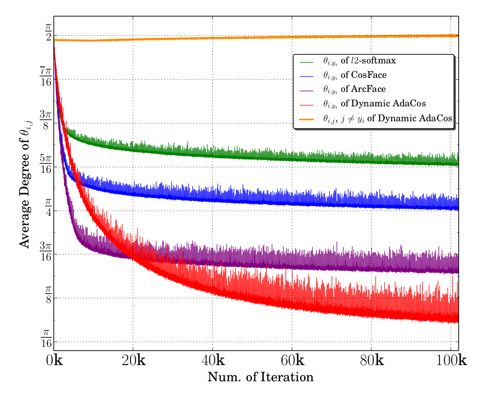
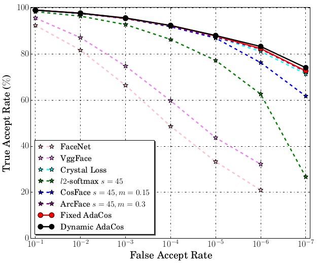
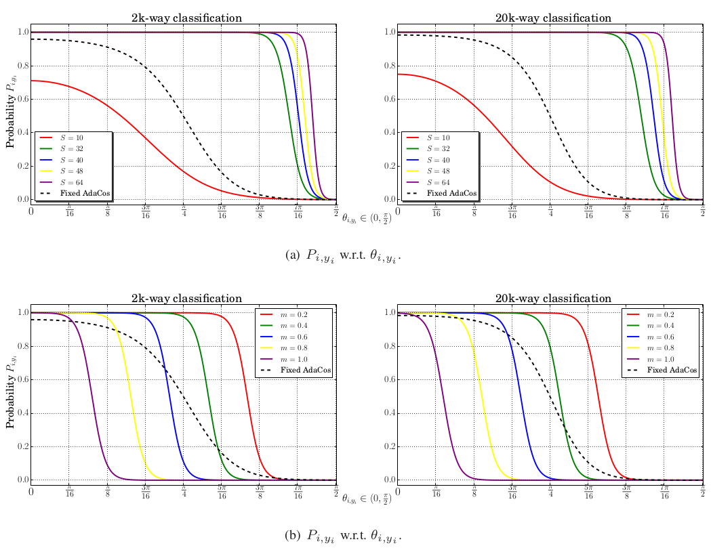

# AdaCos損失: 両手をあげてオススメできない理由

## はじめに
皆さん、損失関数は何を使ってらっしゃいますか？

### ハイパーパラメーターが嫌い
経験と勘がすべてを支配する「ハイパーパラメーター指定」。これは、機械学習において、避けて通りたい作業です。ハイパーパラメーターの調整は、外せばモデルの訓練が不安定になるだけでなく、最終的な認識性能にも悪影響を与える可能性があります。

### ハイパーパラメーターフリー、かつ高性能ときいて
AdaCosはハイパーパラメーターフリーで、訓練過程で自動的にスケールパラメーターを調整できるだけでなく、高い顔認識精度を達成することが可能とききました。

そんな美味しい話があるんですね。

そこで早速、AdaCosを実装してtrainを回してみました。
しかし、なかなか精度が上がりません。どうしてだ。

そんな時は、論文を読むしかありません。

## 結論
下のグラフを見てください。

このグラフを見ると、AdaCosにおいて、同じクラスのコサイン類似度は大きく、逆に異なるクラスのコサイン類似度がグラフ中もっとも小さいことがわかります。

注目すべきは横軸です。
ArcFaceよりAdaCosが優れた値を示すのは、2万epoch以降です。
いや、横軸がepochとは書いてません。ミニバッチかもしれない。それでもエグい数字です。

これだったらArcFaceの方がお手軽ではないかと思いました。

というわけで解散！…でもいいんですけど、AdaCosの仕組みを理解しておきたいので、以降かんたんにまとめました。

## 疑問
- 固定スケールのAdaCosの、イテレーションにおける縦軸がどこにも書いてない。

- 固定スケールファクターならば、ArcFaceと同じepoch数でいけるんじゃないか？

## 用途
不良品検出、顔認証など`open set recognition problem`が絡むタスク

## `Dynamic AdaCos`の導出

## `Fixed AdaCos`の導出

## コサインベースのソフトマックス損失関数からAdaCosへ

### 従来のコサインベースのソフトマックス損失関数

コサインベースのソフトマックス損失関数では、コサイン類似度（cosine similarity）が計算されます。具体的には、特徴ベクトル \( \vec{x_i} \) とクラス \( j \) の重みベクトル \( \vec{W_j} \) の間のコサイン類似度 \( \cos \theta_{i,j} \) が計算されます。

\[
\cos \theta_{i,j} = \frac{\vec{x_i} \cdot \vec{W_j}}{||\vec{x_i}|| \times ||\vec{W_j}||}
\]

このコサイン類似度はスケーリングファクター \( s \) によってスケーリングされます。

\[
f_{i,j} = s \cdot \cos \theta_{i,j}
\]

ArcFaceやCosFaceなどのバリエーションでは、マージン \( m \) が導入されます。

- ArcFace: \( f_{i,j} = s \cdot \cos(\theta_{i,j} + m) \) （式3）
- CosFace: \( f_{i,j} = s \cdot (\cos \theta_{i,j} - m) \) （式4）

### 確率曲線
\[
P_{i,j} = \frac{e^{f_{i,j}}}{\sum_{k=1}^{C} e^{f_{i,k}}}
\]
- \( P_{i,j} \)：i番目のサンプルがj番目のクラスに属する確率
- \( f_{i,j} \)：i番目のサンプルとj番目のクラスに対するロジット（Softmaxの入力）
- \( C \)：クラス数

#### AdaCos

AdaCosでは、スケーリングファクター \( s \) がデータに基づいて動的に調整されます。具体的な数式は論文の後の部分に記載されていますが、基本的なアイデアは、スケーリングファクターが自動的に調整されるため、ハイパーパラメータ \( m \) や \( s \) の手動調整が不要である点です。

#### ハイパーパラメータの影響

スケーリングファクター \( s \) とマージン \( m \) は、モデルの識別能力に大きな影響を与えます。特に、\( s \) はコサイン距離の範囲を拡大し、\( m \) は異なるクラス間のマージンを拡大します。これらのハイパーパラメータは最終的にクラスの確率 \( P_{i,yi} \) に影響を与えます。

### 3.1. スケールパラメーター \( s \) の影響

スケールパラメーター \( s \) は、クラス確率 \( P_{i,yi} \) に大きな影響を与えます。特に、角度 \( \theta_{i,yi} \) が \( \frac{\pi}{2} \) から 0 に減少するにつれて、\( P_{i,yi} \) は 0 から 1 に増加するべきです。

#### 確率の範囲

スケールパラメーター \( s \) が与えられた場合、すべてのコサインベースのソフトマックス損失における確率の範囲は以下のようになります。

\[
1 \leq \frac{1}{1 + (C-1) \cdot e^{-s}} \leq P_{i,j} \leq \frac{e^s}{e^s + (C-1)} \quad \text{(式5)}
\]

ここで、\( C \) はクラス数です。

#### 確率曲線

\( P_{i,yi} \) は \( s \) と角度 \( \theta_{i,yi} \) の関数として表されます。

\[
P_{i,yi} = \frac{e^{s \cdot \cos \theta_{i,yi}}}{e^{s \cdot \cos \theta_{i,yi}} + B_i} \quad \text{(式7)}
\]

ここで、\( B_i \) は非対応クラスのロジットの合計です。

#### 考察

- \( s \) が大きすぎると、確率分布が不適切になる可能性があります。
- \( s \) が小さすぎると、\( P_{i,yi} \) の最大値が 1 に達しない可能性があります。

このように、スケールパラメーター \( s \) は、クラス確率 \( P_{i,yi} \) とモデルの識別能力に大きな影響を与えます。特に、\( s \) の選択は、確率の範囲と確率曲線に影響を与え、それが最終的に訓練プロセスと認識性能に影響を与えます。

### 3.2. マージンパラメータ \( m \) の影響

このセクションでは、マージンパラメータ \( m \) が特徴ベクトル \( \vec{x_i} \) の予測されたクラス確率 \( P_{i,yi} \) に与える影響について調査されています。簡単のため、ArcFace（式3）のマージンパラメータ \( m \) に焦点を当てていますが、CosFace（式4）に対する結論も同様です。

#### クラス確率 \( P_{i,yi} \)

クラス確率 \( P_{i,yi} \) は以下のように書き換えられます。

\[
P_{i,yi} = \frac{e^{s \cdot \cos(\theta_{i,yi} + m)}}{e^{s \cdot \cos(\theta_{i,yi} + m)} + B_i} \quad \text{(式8)}
\]

ここで、\( B_i \) は非対応クラスのロジットの合計です。

#### マージン \( m \) の影響

図2(b)によれば、マージンパラメータ \( m \) を増加させると、確率 \( P_{i,yi} \) の曲線が左にシフトします。つまり、同じ \( \theta_{i,yi} \) でも、大きなマージン \( m \) は \( P_{i,yi} \) を低くし、したがって小さい角度 \( \theta_{i,yi} \) でも損失が大きくなります。

### 図2に対する説明

図2は、マージンパラメータ \( m \) がクラス確率 \( P_{i,yi} \) に与える影響を視覚的に示しています。具体的には、図2(b)において、マージン \( m \) を増加させると、確率 \( P_{i,yi} \) の曲線が左にシフトすることが示されています。

#### 左にシフトする意味

この「左にシフト」とは、同じ角度 \( \theta_{i,yi} \) でも、マージン \( m \) が大きい場合には \( P_{i,yi} \) が低くなる、という意味です。つまり、マージン \( m \) が大きいと、特徴ベクトルとその対応するクラスの重みベクトル間の角度 \( \theta_{i,yi} \) が小さくなければならない（すなわち、より「類似」でなければならない）という制約が強くなります。

#### 結論

特徴ベクトル \( \vec{x_i} \) とその対応するクラスの重みベクトル \( \vec{W_{yi}} \) 間の角度 \( \theta_{i,yi} \) は非常に小さくなければならない。これが、マージンベースの損失が従来のコサインベースの損失よりも強い監視を提供する理由です。

このように、マージン \( m \) は特に小さい角度 \( \theta_{i,yi} \) でのクラス確率 \( P_{i,yi} \) と損失に大きな影響を与え、モデルの識別能力を高める役割があります。

\( B_i \) は「非対応クラスのロジットの合計」という表現が使われていますが、これは以下のような意味です。

#### ロジット（Logit）

ロジットとは、確率をロジスティック関数（またはシグモイド関数）を用いて変換した値です。具体的には、クラス \( j \) に対するロジット \( f_{i,j} \) は、モデルが出力するスコアや確率に基づいています。

#### 非対応クラス

非対応クラスとは、サンプル \( i \) の真のクラス（\( y_i \)）以外のすべてのクラスを指します。例えば、3クラス分類問題でサンプル \( i \) の真のクラスが「犬」であれば、非対応クラスは「猫」と「鳥」です。

#### \( B_i \) の計算

\( B_i \) は、これら非対応クラスのロジット（スコア）を合計したものです。数式で表すと、以下のようになります。

\[
B_i = \sum_{j \neq y_i} e^{f_{i,j}}
\]

この \( B_i \) は、クラス確率 \( P_{i,yi} \) を計算する際の分母に含まれ、確率の正規化（合計が1になるように調整）に使用されます。

このように、\( B_i \) は非対応クラスに対するモデルの確信度（スコア）を合計したものであり、クラス確率 \( P_{i,yi} \) の計算に重要な役割を果たします。

#### 損失の増加

この結果、小さい角度 \( \theta_{i,yi} \) でも損失が大きくなり、モデルはより厳格な条件下で訓練されます。これが、マージンベースの損失関数が高い識別能力を持つ理由の一つです。

このように、図2はマージン \( m \) の値によって、クラス確率 \( P_{i,yi} \) の分布がどのように変わるのかを効果的に示しています。

まず、\( f_{i,j} = s \cdot \cos \theta_{i,j} \) は、スケーリングされたコサイン距離です。これは確率 \( P \) とは異なります。確率 \( P \) は、このスケーリングされたコサイン距離を使って計算されるものです。

### \( B_i \) とは？
\( B_i \) は「非対応クラスのロジットの合計」とされています。つまり、\( B_i \) は、対象のデータポイント \( \vec{x_i} \) が属さないクラスに対するスケーリングされたコサイン距離（ロジット）の合計です。

### \( B(t)_{\text{avg}} \) とは？
\( B(t)_{\text{avg}} \) は、\( B_i \) の平均値です。具体的には、ミニバッチ内のすべての \( B_i \) を平均した値です。この平均値は、動的に適応するスケールパラメータ \( \tilde{s}_d \) を計算する際に使用されます。

### \( \tilde{s}_d \) の計算
動的に適応するスケールパラメータ \( \tilde{s}_d \) は、以下の式で計算されます。
\[
\tilde{s}(t)_d = \log B(t)_{\text{avg}} / \cos \theta(t)_{\text{med}}
\]
ここで \( \theta(t)_{\text{med}} \) は、ミニバッチ内のすべての対応するクラスの角度 \( \theta(t)_{i,yi} \) の中央値（メディアン）です。

この式、\[
\tilde{s}(t)_d = \log B(t)_{\text{avg}} / \cos \theta(t)_{\text{med}}
\]
は、6ページ目に出てきます。この式は、動的に適応するスケールパラメータ \( \tilde{s}_d \) を計算するためのものです。

### \( B(t)_{\text{avg}} \) と \( \theta(t)_{\text{med}} \)
- \( B(t)_{\text{avg}} \) は、ミニバッチ内の非対応クラスのロジット（スケーリングされたコサイン距離）の平均値です。
- \( \theta(t)_{\text{med}} \) は、ミニバッチ内の対応するクラスの角度 \( \theta(t)_{i,yi} \) の中央値（メディアン）です。

この式は、訓練が進むにつれて、スケールパラメータ \( s \) を動的に調整するために導入されました。この動的な調整により、モデルの訓練がより効率的に行えるとされています。

式 (14) 。
\[
\tilde{s}(t)_d = \log B(t)_{\text{avg}} / \cos \theta(t)_{\text{med}}
\]
この式は、動的に適応するスケールパラメータ \( \tilde{s}_d \) を計算するためのものです。このスケールパラメータは、訓練が進むにつれて調整され、モデルの性能を向上させることが期待されています。

\( B(t)_{\text{avg}} \) はミニバッチ内の非対応クラスのロジットの平均値、\( \theta(t)_{\text{med}} \) はミニバッチ内の対応するクラスの角度の中央値（メディアン）です。

この動的なスケールパラメータ \( \tilde{s}_d \) は、訓練過程でのネットワークの最適化状態をより良く反映するために導入されています。

動的に適応するスケールパラメータ \( \tilde{s}_d \) は、以下のように最終的な損失関数に組み込まれます。

\[
f_{i,j} = \tilde{s}_d \cdot \cos \theta_{i,j}
\]

そして、確率 \( P_{i,yi} \) は次のように計算されます。

\[
P_{i,yi} = \frac{e^{\tilde{s}_d \cdot \cos \theta_{i,yi}}}{e^{\tilde{s}_d \cdot \cos \theta_{i,yi}} + B_i}
\]

ここで \( f_{i,j} \) は、特徴ベクトル \( \vec{x_i} \) とクラス \( j \) の重みベクトル \( \vec{W_j} \) のコサイン距離にスケールパラメータ \( \tilde{s}_d \) を掛けたものです。確率 \( P_{i,yi} \) は、この \( f_{i,j} \) を用いてソフトマックス関数で計算されます。

\( B_i \) は非対応クラスのロジット（スケールされたコサイン距離）の合計です。

このようにして、動的に適応するスケールパラメータ \( \tilde{s}_d \) は最終的な損失関数に組み込まれ、モデルの訓練に影響を与えます。