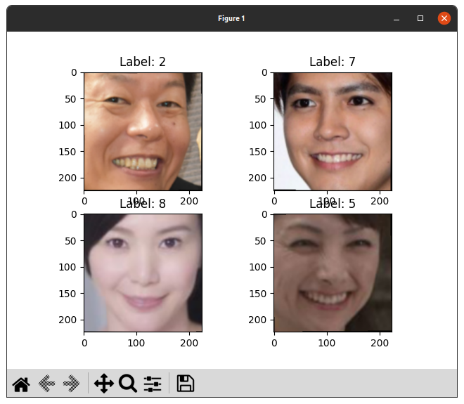

# AdaCosのすすめ：固定スケールで使おう！

## はじめに
皆さん、損失関数は何を使ってらっしゃいますか？
不良品検出、顔認証など`open set recognition problem`が絡むタスクでは、`ArcFace`がよく使われている印象を受けます。
でも、`ArcFace`にはスケールファクターとマージンのハイパーパラメーターがあり、煩雑です。
`AdaCos`の論文に載っている固定スケールファクターを使えば、少なくともスケーリングファクターを調整する必要はなくなります。

## 結論
`AdaCos`を固定スケールで使うと、同等の処理時間で`ArcFace`よりも高い精度が出ました。

| Loss Function  | Training Accuracy (%) | Test Accuracy (%) | Test Loss               |
|----------------|-----------------------|-------------------|-------------------------|
| ArcFace        | 98.61                 | 85.22             | N/A                     |
| **AdaCos**     | **99.42**             | **90.02**         | N/A                     |
| CrossEntropy   | 94.57                 | 89.44             | 0.022136613415579192    |

- dataset
  - 16 directories, 2602 files
    

### ハイパーパラメーターが嫌い
経験と勘がすべてを支配する「ハイパーパラメーター指定」。これは、機械学習において、**避けて通りたい**作業です。
ハイパーパラメーターの調整は、外せばモデルの訓練が不安定になり、精度にも悪影響がでます。
自動調整するライブラリもあるにはありますが、時間もかかりますし、パラメーター範囲の指定も必要です。

### ハイパーパラメーターフリー、かつ高性能ときいて
「AdaCosはハイパーパラメーターフリーで、訓練過程で自動的にスケールパラメーターを調整できるだけでなく、高い顔認識精度を達成することが可能」、とききました。

そんな美味しい話があるんですね。

そこで早速、AdaCosを実装してtrainを回してみました。
しかし、なかなか精度が上がりません。どうしてだ。

そんな時は、論文を読むしかありません。
下のグラフを見てください。

このグラフを見ると、AdaCosにおいて、同じクラスのコサイン類似度は大きく、逆に異なるクラスのコサイン類似度がグラフ中もっとも小さいことがわかります。

注目すべきは横軸です。
**ArcFaceよりAdaCosが優れた値を示すのは、2万epoch以降です**。
いや、横軸がepochとは書いてません。ミニバッチかもしれない。それでもエグい数字です。

これだったらArcFaceの方がお手軽ではないかと思いました。

というわけで解散！…でもいいんですけど、AdaCosの論文には「固定スケーリングファクター」なるものも紹介されています。それを試してみてからでも遅くはありません。

## 疑問
- 固定スケールAdaCosの、イテレーションにおける縦軸がどこにも書いてない。

- 固定スケールファクターならば、ArcFaceと同じepoch数でいけるんじゃないか？

## `Fixed AdaCos`
\[
\tilde{s}_f = \sqrt{2} \cdot \log(C - 1)
\]
クラス数が$ 16 $だとすると、$ 約3.829 $。

## 実装
2パターンを用意しました。
- `loss_test.py`
  - dataset
    - MNIST
  - model
    - 独自実装
- `loss_test_face_recognition.py`
  - dataset
    - 16 directories, 2602 face image files
  - model
    - EfficientNetV2-b0

### `loss_test.py`

